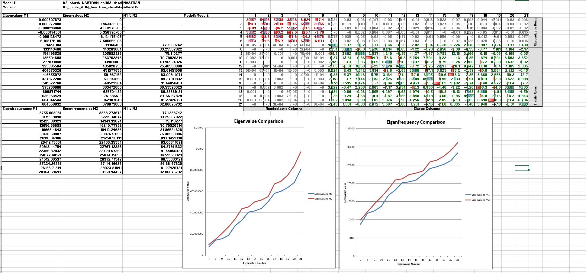

# eigenmodes_comparison_abq_vs_nastran

performs eigenmode comparison in between two solvers: abaqus vs nastran.
user needs to provide the necessary files, those shall be already computed priororily. 

I am in this moment no sure but, eventually metapost bindings might be necessary as well. 
The output is excel: 

